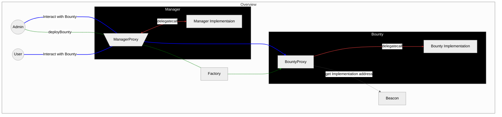

# Saloon Smart Contracts Layout

The only entry point to interact with the Saloon smart contracts is through the `Manager` address.

- Projects can make and withdraw their bounty deposits.
- Investors can stake and unstake
- Admins can deploy and manage bounties.



```mermaid
%%{init: { "theme": "neutral" } }%%
graph TD;
    subgraph Upgrading Implementation Contracts
        Admin((Admin))-- Upgrade Manager Implementation ----ManagerProxy[\ManagerProxy/]
        Admin-- Upgrade Bounty Implementation ----ManagerProxy

        subgraph Manager
        ManagerProxy-- delegatecall --Implementation[Manager Implementaion]
        Implementation-- upgradeTo -->Implementation
        end

        ManagerProxy --> Beacon
    end

    linkStyle 0,1,2,3 fill:none,stroke-width:2px,stroke:orange
    linkStyle 1,4 fill:none,stroke-width:2px,stroke:brown


    style Manager fill:#000,color:#fff,arrowheadPath:#fff
```
