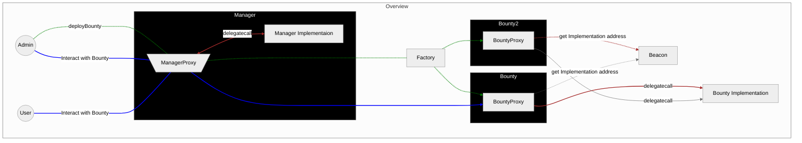
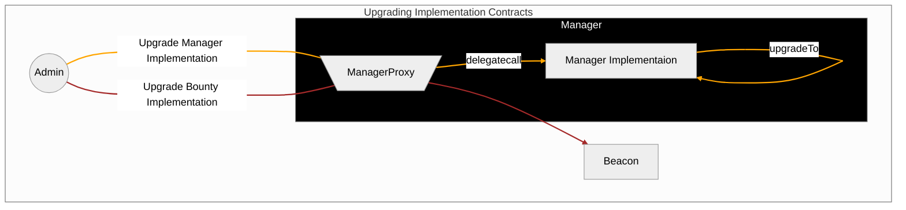

# Saloon Smart Contracts Layout

The only entry point to interact with the Saloon smart contracts is through the `Manager` address.

- Projects can make and withdraw their bounty deposits.
- Investors can stake and unstake
- Admins can deploy and manage bounties.

### Upgrading Proxy Implementation Contract

- Changing the ManagerProxy implementation is done by calling the current implementation which updates itself.

- All bounty proxies refer to the same implementation address via the Beacon. Therefore changing the address the Beacon refers to will update the implementation address for all bounty proxies.

