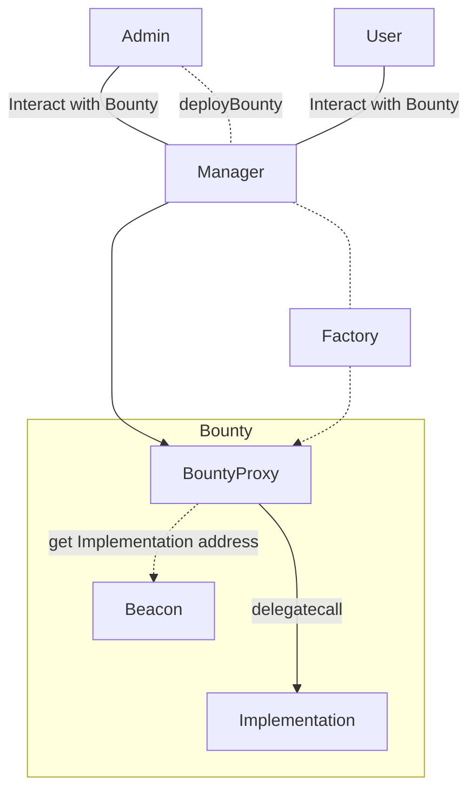

# Saloon Smart Contracts Layout

The only entry point to interact with the Saloon smart contracts is through the `Manager` address.

- Projects can make and withdraw their bounty deposits.
- Investors can stake and unstake
- Admins can deploy and manage bounties.

